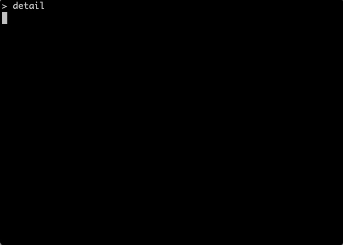
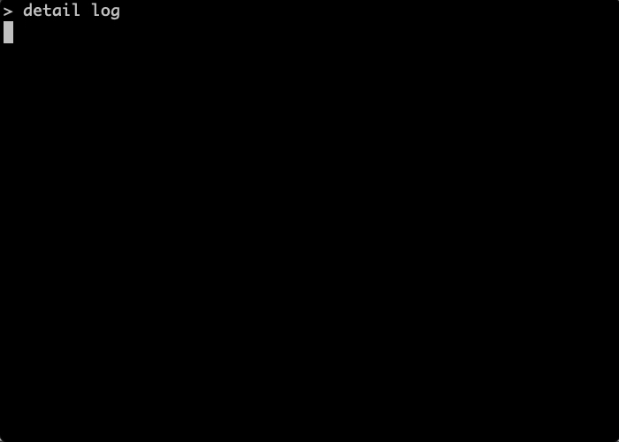

# Tutorial

This tutorial dives right into the core concepts you need in order to:

1. Collect notes matching a schema from contributors.
2. Lint notes, ensuring that contributors provide notes and that they match the schema.
3. Render notes in however you need, whether that's for changelog generation or other automations such as version bumping.

We'll first cover an example schema and how users can create or update notes.

## An Example Schema and Note

`detail` works by reading a schema that's specified in the `.detail/schema.yaml` file. The schema represents a [formaldict](https://github.com/Opus10/formaldict) schema, providing the means to prompt users for relevant information in the schema.

In this example, we want to ensure that our notes all have the following information:

1. A summary about the contribution.
2. An optional description.
3. A required type. We want to prompt the user to categorize the type of contribution with the following choices - api-break, bug, feature, or trivial.

Our schema looks like this:

```yaml
- label: type
  name: Type
  help: The type of change.
  type: string
  choices:
    - api-break
    - bug
    - feature
    - trivial

- label: summary
  name: Summary
  help: A high-level summary.
  type: string

- label: description
  name: Description
  help: An in-depth description.
  type: string
  condition: ['!=', 'type', 'trivial']
  multiline: True
  required: False
```

In the above, our schema has a "type" attribute that will be collected. When we prompt the user for the type, the user will see the help text and will only be able to enter one of the four choices.

The [formaldict library](https://github.com/opus10/formaldict) that parses the schema is directly integrated with [python-prompt-toolkit](https://github.com/prompt-toolkit/python-prompt-toolkit), meaning any information entered gathered by the prompt will validate the schema (and our linting we will do later!).

When the schema is stored in the `.detail/schema.yaml` of a project, a user will go through this flow when creating a note (i.e. calling `detail` from the command line):



The note is stored under `.detail/notes/<year>_<month>_<day>_<hash>.yaml` and looks like this:

```shell
> cat .detail/notes/2022-03-21-67c3d1.yaml
"description": |-
  Wow, what a wonderful feature. This
  message can span multiple lines too.
"summary": |-
  This is a great feature
"type": |-
  feature
```

Now that the note is saved, you can `git commit` it to the project and use the other `detail` subcommands.

## Linting Notes

`detail` comes with a linter, allowing verification that at least one note was provided, along with ensuring that each note adheres to the schema.

When running the linter, one must supply a range of commits to validate. Normally this is done against the branch over which a pull request will be submitted. For example, `detail lint origin/develop..` will lint all of the commits on your branch since `origin/develop`.

Linting will pass if any of the following are true:

1. There are no commits in the range. For example, running `detail lint main..` while on the `main` branch will result in linting passing since there are no commits.
2. There is at least one commit, at least one note, and all notes present in the commit range adhere to the `detail` schema.

`detail` comes built in with Github support. In order to lint against all of the commits against the base branch of an open pull request, run `detail lint :github/pr`. The special ":github/pr" range tells `detail` to look up the base branch of the open pull request.

!!! note

    One must provision a `GITHUB_API_TOKEN` environment variable with a personal access token from Github in order to enable this feature.

## Rendering Notes

Want to render a changelog or extract information from your notes for performing automations? Notes can be rendered by a user-supplied Jinja template and the `detail log` subcommand.

By default, `detail` checks the `.detail/log.tpl` for the log to use when calling `detail log`. This Jinja template is supplied the following variables:

1. `output` - The output file, if any, supplied to `detail log`.
2. `range` - The range of commits (if any) being logged.
3. `notes` - The `detail.NoteRange` object retrieved when parsing any git filters provided to `detail log`. The `detail.NoteRange` object has methods for grouping and filtering notes by their values and associated git properties.

Similar to linting, `detail log` takes a range of commits as an argument. For example, to render a log with everything after tag `v1`, do `detail log v1..`.

Here's an example of a [Jinja](https://jinja.palletsprojects.com/en/2.10.x/api/) template to render our example schema. Again, this template is stored in our repo at `.detail/log.tpl`:

```jinja

## {{ tag|default('Unreleased', True) }} ({{ tag.date.date() }})


### {{ type|default('Other', True)|title }}


- {{ note.summary }} [{{ note.commit_author_name }}, {{ note.commit_sha[:7] }}]


   {{ note.description|indent(2) }}





```

In the above template, we are grouping our notes by tag first and by type
second. Here's what it looks like to log two example notes using this template:



!!! note

    Remember that notes must be committed before they can be linted or logged. This is what allows us to attached git information to notes, such as tags and authors.

In the above example, we're rendering our summary, description, and other information gathered by our schema. We're also rendering git-based information such as tags and commit authors.

`detail` collects git-based information under the `commit_*` attribute of each note. Below are the git-based attributes you can group by and render.

1. `commit_sha` - Full SHA of the commit.
2. `commit_author_name` - The author name of the commit.
3. `commit_author_email` - The author email of the commit.
4. `commit_author_date` - The time at which the commit was authored.
5. `commit_committer_name` - The name of the person who performed the commit.
6. `commit_committer_email`- The email of the person who performed the commit.
7. `commit_committer_date` - The time at which the commit was performed.
8. `commit_tag` - The tag, if any, that contains the commit.

Along with commit information, one can also render if notes didn't pass vaildation. In theory one shouldn't let notes that don't pass schema validation through. These attributes, however, allow one to render invalid notes and errors:

1. `is_valid` - `True` if the note passed validation, `False` otherwise. If `False`, some of the user-supplied attributes may not be available.
2. `validation_errors` - The validation errors, if any, that happened.

!!! note

    All of these attributes, along with any defined in the commit, can be used for grouping and filtering `detail.NoteRange` objects.

If one wishes to have separate templates for separate types of renderings (e.g. a verbose change log vs a summary), use the `--style` option. The `--style` option will use a template under the path of `.detail/log_{{ style }}.tpl`.

A template definition can also be passed directly to the command line via the `--template` option. For example, let's say one wishes to print off all `type` attributes of notes in our example schema:

```shell
detail log --template '{{ note.type }}\n'
```

`detail log` takes other parameters for filtering notes based on commits. It also takes parameters to ensure proper tags are matched whenever mutliple tags might reference the same note. Use `detail log --help` to see all options or check out the :ref:`cli` docs.

!!! note

    `detail log` has the ability to redirect the log to a file with the `-o` option. One can also use `detail log :github/pr -o :github/pr` to generate a log based on a Github pull request and also send the output as a Github pull request comment. This can be used for integrating log previews into your continuous integration and pull request review process.


## More Examples
 
For more examples of schema specifications, check out the [formaldict Docs](https://formaldict.readthedocs.org). Check the docs for [detail.NoteRange][] for all of the available methods one can use when rendering commits in templates. And finally, brush up on your [Jinja](https://jinja.palletsprojects.com/en/2.10.x/api/) for more expressive log rendering.
